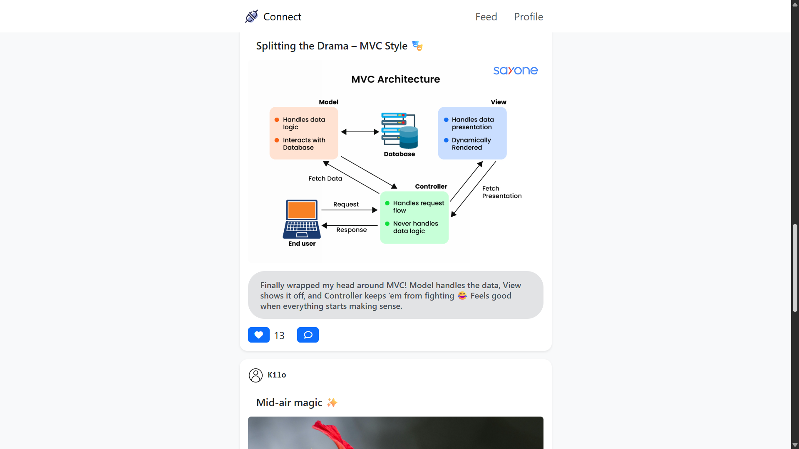

# Connect - A Social Media Project

Connect is a full stack social media app where users can sign up, log in, create posts, and interact with other people’s posts by liking, commenting, and more. It’s built to bring people together and make sharing easy and fun.

**Link to project:** [Connect](https://connect-b9p9.onrender.com)  

**Screenshot:**  
  

**Alt tag:**  
Screenshot of the Connect app homepage showing the post feed and user interactions.

---

## How It's Made  
**Tech used:** Node.js, Express.js, MongoDB, EJS, Passport.js, Cloudinary

This app uses Node.js and Express.js for the backend server and routing. MongoDB stores users, posts, likes, and comments. Passport.js manages secure user authentication and sessions. Cloudinary is used for storing and delivering uploaded images efficiently. The frontend is rendered dynamically with EJS templates, making it easy to build reusable UI components and serve personalized content.

---

## Optimizations *(planned for future)*  
- Improving database queries and indexing for faster data retrieval  
- Adding caching mechanisms to reduce server load  
- Enhancing UI with client-side rendering for smoother interactions  
- Implementing real-time updates with WebSocket or similar tech  
- Optimizing image delivery and storage costs on Cloudinary

---

## Lessons Learned  
Building Connect gave me hands-on experience with full stack development, especially integrating authentication and cloud storage. I learned how to create interactive social features and render dynamic pages using EJS. This project helped me understand how the frontend and backend work together to create a seamless user experience.
